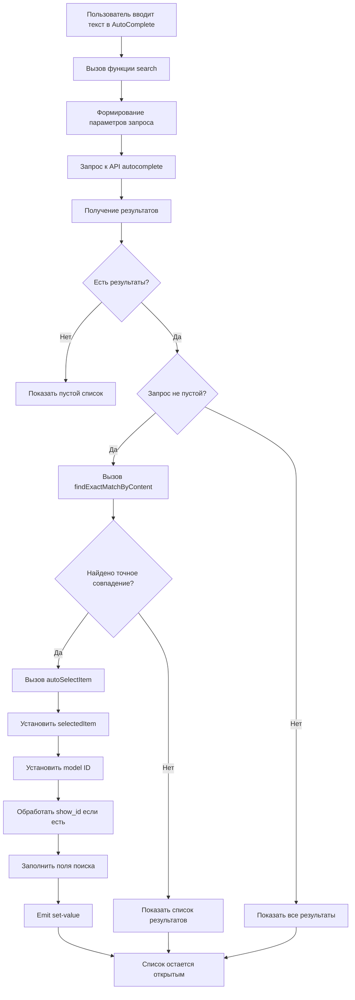

# План реализации автовыбора для PVMultiAutoComplete

## Требования (согласовано с пользователем)

### Основное поведение
- **Тип автовыбора:** При точном совпадении по полю `content`
- **Сравнение:** Без учета регистра (case-insensitive)
- **После автовыбора:** Оставить выпадающий список открытым

### Примеры работы
1. Пользователь вводит "4" → если есть элемент с `content = "4"` → автоматически выбирается
2. Пользователь вводит "Заказ 4" → если есть элемент с `content = "заказ 4"` → автоматически выбирается
3. Пользователь вводит "4" → если есть несколько элементов, но нет точного совпадения → показывается список для выбора

## Технический план реализации

### Шаг 1: Добавить вспомогательную функцию поиска точного совпадения

**Файл:** `src/components/PVMultiAutoComplete.vue`

**Место:** После функции `search()`, перед `onLazyLoad()`

```javascript
// Функция для поиска точного совпадения по content
const findExactMatchByContent = (query, items) => {
  if (!query || !items || items.length === 0) {
    return null;
  }
  
  const normalizedQuery = query.trim().toLowerCase();
  
  return items.find(item => {
    if (!item.content) {
      return false;
    }
    
    const normalizedContent = String(item.content).trim().toLowerCase();
    return normalizedContent === normalizedQuery;
  });
};
```

### Шаг 2: Добавить функцию автоматического выбора элемента

**Файл:** `src/components/PVMultiAutoComplete.vue`

**Место:** После функции `findExactMatchByContent()`

```javascript
// Функция для автоматического выбора элемента
const autoSelectItem = (item) => {
  if (!item) return;
  
  selectedItem.value = item;
  model.value = item.id;
  
  // Обработка show_id если настроено
  if (props.field.show_id) {
    if (item[props.field.show_id] && item[props.field.show_id] > 0) {
      show_id.value = item[props.field.show_id];
    } else {
      show_id.value = model.value;
    }
  }
  
  // Автоматически заполняем поля поиска на основе выбранного значения
  fillSearchFieldsFromOption(item);
  
  // Уведомляем родительский компонент
  emit('set-value');
  
  // ВАЖНО: Список остается открытым, пользователь может выбрать другой элемент
};
```

### Шаг 3: Модифицировать функцию search()

**Файл:** `src/components/PVMultiAutoComplete.vue`

**Место:** Функция `search()` (строки 416-474)

**Изменения:**
```javascript
const search = async ({ query }) => {
  try {
    // Сбрасываем пагинацию при новом поиске
    pagination.value.offset = 0;
    pagination.value.hasMore = true;
    pagination.value.currentQuery = query;
    pagination.value.allowLazyLoad = false;
    
    if (!props.field.ids) {
      props.field.ids = '';
    }
    
    // Добавляем фильтры из полей поиска
    let searchParams = {
      query: query,
      parent: props.field.parent,
      ids: props.field.ids,
      limit: pagination.value.limit,
      offset: pagination.value.offset
    };

    if (props.field.where) {
      searchParams.where = props.field.where;
    }

    const searchFilters = {};
    for (const [fieldKey, value] of Object.entries(searchValues.value)) {
      if (value && value.id) {
        searchFilters[fieldKey] = { value: value.id };
      }
    }
    
    if (Object.keys(searchFilters).length > 0) {
      searchParams.search = searchFilters;
    }
    
    pagination.value.currentSearchFilters = searchFilters;

    const response = await api.autocomplete(searchParams);
    items.value = response.data.rows;
    pagination.value.total = response.data.total || 0;
    pagination.value.hasMore = items.value.length < pagination.value.total;
    
    if (response.data.template) {
      apiTemplate.value = response.data.template;
    }
    
    // ========== НОВАЯ ЛОГИКА: Автовыбор при точном совпадении ==========
    if (items.value.length > 0 && query.trim() !== '') {
      const exactMatch = findExactMatchByContent(query, items.value);
      if (exactMatch) {
        autoSelectItem(exactMatch);
        // Список остается открытым для возможности выбора другого элемента
      }
    }
    // ===================================================================
    
    setTimeout(() => {
      pagination.value.allowLazyLoad = true;
    }, 100);
    
  } catch (error) {
    notify('error', { detail: error.message });
  }
};
```

## Диаграмма работы



## Пример использования

### Сценарий 1: Точное совпадение найдено
```
Пользователь вводит: "4"
API возвращает: [
  { id: 123, content: "4", ... },
  { id: 124, content: "40", ... },
  { id: 125, content: "400", ... }
]
Результат: Автоматически выбирается элемент с id=123 (content="4")
Список: Остается открытым, показывает все 3 элемента
```

### Сценарий 2: Точное совпадение не найдено
```
Пользователь вводит: "4"
API возвращает: [
  { id: 124, content: "40", ... },
  { id: 125, content: "400", ... }
]
Результат: Ничего не выбирается автоматически
Список: Открыт, показывает 2 элемента для ручного выбора
```

### Сценарий 3: Совпадение без учета регистра
```
Пользователь вводит: "Заказ 4"
API возвращает: [
  { id: 123, content: "заказ 4", ... },
  { id: 124, content: "Заказ 40", ... }
]
Результат: Автоматически выбирается элемент с id=123
Список: Остается открытым
```

## Преимущества выбранного решения

1. **Простота реализации** - минимальные изменения в коде
2. **Предсказуемость** - автовыбор только при точном совпадении
3. **Гибкость** - пользователь может изменить выбор, список остается открытым
4. **Производительность** - поиск точного совпадения O(n), где n - количество результатов
5. **Безопасность** - не меняет существующую логику, только добавляет новую

## Возможные улучшения в будущем

### 1. Визуальная индикация автовыбора
Подсветить автоматически выбранный элемент в списке:
```javascript
const autoSelectItem = (item) => {
  // ... существующий код ...
  
  // Добавить класс для подсветки
  item._autoSelected = true;
  
  // Убрать подсветку через 2 секунды
  setTimeout(() => {
    item._autoSelected = false;
  }, 2000);
};
```

### 2. Настройка через конфигурацию
Добавить возможность включения/выключения автовыбора:
```javascript
field: {
  table: 'orders',
  label: 'Заказ',
  autoSelect: true, // включить автовыбор
  autoSelectMode: 'exact', // 'exact' | 'single' | 'both' | 'none'
}
```

### 3. Поддержка дополнительных полей для сравнения
```javascript
const findExactMatch = (query, items) => {
  const normalizedQuery = query.trim().toLowerCase();
  
  return items.find(item => {
    // Проверка по content
    if (item.content && String(item.content).trim().toLowerCase() === normalizedQuery) {
      return true;
    }
    
    // Проверка по ID (опционально)
    if (props.field.autoSelectFields?.includes('id')) {
      if (String(item.id) === normalizedQuery) {
        return true;
      }
    }
    
    // Проверка по show_id (опционально)
    if (props.field.autoSelectFields?.includes('show_id') && item[props.field.show_id]) {
      if (String(item[props.field.show_id]).toLowerCase() === normalizedQuery) {
        return true;
      }
    }
    
    return false;
  });
};
```

### 4. Debounce для автовыбора
Добавить небольшую задержку перед автовыбором, чтобы пользователь успел увидеть список:
```javascript
let autoSelectTimeout = null;

const search = async ({ query }) => {
  // ... существующий код ...
  
  if (exactMatch) {
    // Очищаем предыдущий таймер
    if (autoSelectTimeout) {
      clearTimeout(autoSelectTimeout);
    }
    
    // Автовыбор с задержкой 200ms
    autoSelectTimeout = setTimeout(() => {
      autoSelectItem(exactMatch);
    }, 200);
  }
};
```

## Тестирование

### Тестовые сценарии

1. **Точное совпадение по числу**
   - Ввод: "4"
   - Ожидание: Автовыбор элемента с content="4"

2. **Точное совпадение по тексту**
   - Ввод: "Заказ 4"
   - Ожидание: Автовыбор элемента с content="заказ 4" (без учета регистра)

3. **Нет точного совпадения**
   - Ввод: "4"
   - Результаты: ["40", "400", "4000"]
   - Ожидание: Список открыт, ничего не выбрано

4. **Пустой запрос**
   - Ввод: ""
   - Ожидание: Показать все результаты, ничего не выбирать

5. **Пробелы в запросе**
   - Ввод: "  4  "
   - Ожидание: Автовыбор элемента с content="4" (пробелы игнорируются)

6. **Изменение выбора после автовыбора**
   - Ввод: "4" → автовыбор
   - Действие: Клик на другой элемент
   - Ожидание: Выбирается новый элемент

7. **Работа с полями поиска**
   - Ввод: "4" с активными фильтрами
   - Ожидание: Автовыбор работает с учетом фильтров

## Риски и митигация

| Риск | Вероятность | Влияние | Митигация |
|------|-------------|---------|-----------|
| Автовыбор мешает пользователю | Низкая | Средняя | Список остается открытым, можно выбрать другой |
| Проблемы с производительностью | Низкая | Низкая | Поиск O(n), где n обычно < 100 |
| Конфликт с существующей логикой | Низкая | Высокая | Тщательное тестирование |
| Проблемы с кодировкой текста | Средняя | Низкая | Использование toLowerCase() |

## Чеклист реализации

- [ ] Добавить функцию `findExactMatchByContent()`
- [ ] Добавить функцию `autoSelectItem()`
- [ ] Модифицировать функцию `search()`
- [ ] Протестировать базовые сценарии
- [ ] Протестировать с полями поиска
- [ ] Протестировать с show_id
- [ ] Проверить работу с виртуальным скроллингом
- [ ] Проверить работу с пагинацией
- [ ] Документировать изменения
- [ ] Code review

## Оценка сложности

- **Сложность реализации:** Низкая (1-2 часа)
- **Риск регрессии:** Низкий
- **Количество изменяемых файлов:** 1
- **Количество новых строк кода:** ~40-50

## Следующие шаги

1. Реализовать базовую функциональность согласно плану
2. Протестировать на реальных данных
3. Собрать обратную связь от пользователей
4. При необходимости добавить дополнительные улучшения (визуальная индикация, настройки и т.д.)
