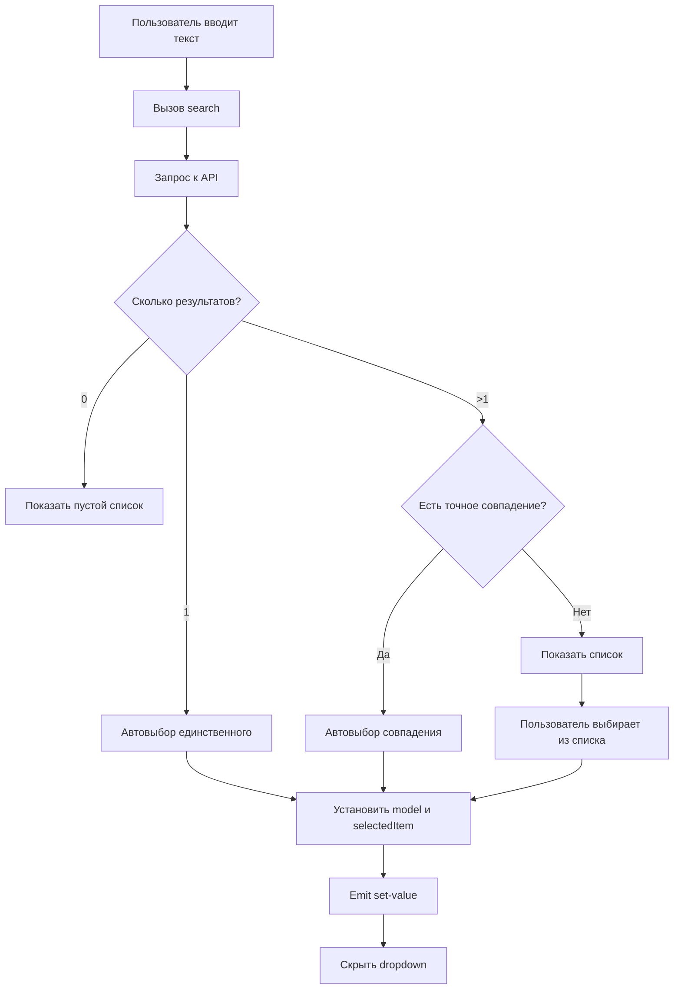

# План улучшения UX для PVMultiAutoComplete

## Текущая проблема

Пользователи вводят номер заказа (например, "4") в поле автокомплита и ожидают, что заказ автоматически выберется. Однако текущая реализация:

1. Показывает выпадающий список с результатами поиска
2. Требует от пользователя кликнуть на нужный элемент из списка
3. Только после клика присваивает ID выбранного элемента

Это создает дополнительный шаг взаимодействия, который раздражает пользователей.

## Анализ текущей реализации

### Компонент PVMultiAutoComplete.vue

**Основное поле ввода (строки 21-37):**
```vue
<AutoComplete
  v-model="selectedItem"
  dropdown
  option-label="content"
  :suggestions="items"
  @complete="search"
  @item-select="onAutocompleteItemSelect"
/>
```

**Поле ID (строки 5-19):**
- Есть два режима: обычный (`model`) и с отображаемым ID (`show_id`)
- При вводе в поле ID и нажатии Enter/blur вызывается `onUserInputEnd` или `onUserInputEndShowId`
- Эти функции делают запрос к API и проверяют существование записи

### Текущий flow работы

1. **Ввод в поле ID** → `onUserInputEnd` → запрос к API → установка `selectedItem` и `model`
2. **Ввод в AutoComplete** → `search` → показ списка → клик → `onAutocompleteItemSelect` → установка `model`

## Предложения по улучшению

### Вариант 1: Автоматический выбор при единственном результате ⭐ (Рекомендуемый)

**Описание:**
Если поиск возвращает только один результат, автоматически выбирать его без необходимости клика.

**Преимущества:**
- Минимальные изменения в коде
- Интуитивное поведение для пользователя
- Сохраняет возможность выбора при множественных результатах

**Недостатки:**
- Если пользователь ошибся, нужно будет очистить и ввести заново

**Реализация:**
```javascript
const search = async ({ query }) => {
  // ... существующий код поиска ...
  
  const response = await api.autocomplete(searchParams);
  items.value = response.data.rows;
  
  // НОВОЕ: Автоматический выбор при единственном результате
  if (items.value.length === 1) {
    selectedItem.value = items.value[0];
    model.value = items.value[0].id;
    
    if (props.field.show_id) {
      show_id.value = items.value[0][props.field.show_id] || model.value;
    }
    
    emit('set-value');
    // Скрываем dropdown после автовыбора
    setTimeout(() => {
      hide();
    }, 100);
  }
}
```

### Вариант 2: Автовыбор при точном совпадении

**Описание:**
Если введенный текст точно совпадает с одним из результатов (по ID или отображаемому полю), автоматически выбирать его.

**Преимущества:**
- Работает даже при множественных результатах
- Пользователь может ввести точный номер и нажать Enter

**Недостатки:**
- Сложнее реализация
- Нужно определить критерии "точного совпадения"

**Реализация:**
```javascript
const search = async ({ query }) => {
  // ... существующий код поиска ...
  
  const response = await api.autocomplete(searchParams);
  items.value = response.data.rows;
  
  // НОВОЕ: Поиск точного совпадения
  const exactMatch = items.value.find(item => {
    // Проверяем совпадение по ID
    if (String(item.id) === String(query)) return true;
    
    // Проверяем совпадение по show_id
    if (props.field.show_id && String(item[props.field.show_id]) === String(query)) {
      return true;
    }
    
    // Проверяем совпадение по content (без учета регистра)
    if (item.content && item.content.toLowerCase() === query.toLowerCase()) {
      return true;
    }
    
    return false;
  });
  
  if (exactMatch) {
    selectedItem.value = exactMatch;
    model.value = exactMatch.id;
    
    if (props.field.show_id) {
      show_id.value = exactMatch[props.field.show_id] || model.value;
    }
    
    emit('set-value');
    setTimeout(() => {
      hide();
    }, 100);
  }
}
```

### Вариант 3: Автовыбор по Enter при фокусе на первом элементе

**Описание:**
После ввода текста и появления списка, первый элемент автоматически получает фокус. Нажатие Enter выбирает его.

**Преимущества:**
- Пользователь контролирует момент выбора
- Можно быстро выбрать первый результат через Enter
- Можно навигировать стрелками для выбора другого

**Недостатки:**
- Требует дополнительного нажатия Enter
- Уже частично реализовано в AutoComplete

**Реализация:**
Уже работает через встроенный функционал AutoComplete с параметром `autoOptionFocus`.

### Вариант 4: Комбинированный подход ⭐⭐ (Наилучший UX)

**Описание:**
Комбинация вариантов 1 и 2:
1. Если результат один - автоматически выбираем
2. Если результатов несколько, но есть точное совпадение - выбираем его
3. В остальных случаях - показываем список

**Преимущества:**
- Максимально интуитивное поведение
- Покрывает большинство сценариев использования
- Минимизирует количество кликов

**Недостатки:**
- Чуть более сложная логика

**Реализация:**
```javascript
const search = async ({ query }) => {
  try {
    // Сбрасываем пагинацию при новом поиске
    pagination.value.offset = 0;
    pagination.value.hasMore = true;
    pagination.value.currentQuery = query;
    pagination.value.allowLazyLoad = false;
    
    if (!props.field.ids) {
      props.field.ids = '';
    }
    
    // Подготовка параметров поиска
    let searchParams = {
      query: query,
      parent: props.field.parent,
      ids: props.field.ids,
      limit: pagination.value.limit,
      offset: pagination.value.offset
    };

    if (props.field.where) {
      searchParams.where = props.field.where;
    }

    // Добавляем фильтры из полей поиска
    const searchFilters = {};
    for (const [fieldKey, value] of Object.entries(searchValues.value)) {
      if (value && value.id) {
        searchFilters[fieldKey] = { value: value.id };
      }
    }
    
    if (Object.keys(searchFilters).length > 0) {
      searchParams.search = searchFilters;
    }
    
    pagination.value.currentSearchFilters = searchFilters;

    const response = await api.autocomplete(searchParams);
    items.value = response.data.rows;
    pagination.value.total = response.data.total || 0;
    pagination.value.hasMore = items.value.length < pagination.value.total;
    
    if (response.data.template) {
      apiTemplate.value = response.data.template;
    }
    
    // ========== НОВАЯ ЛОГИКА АВТОВЫБОРА ==========
    
    // Вариант 1: Единственный результат - автоматически выбираем
    if (items.value.length === 1) {
      autoSelectItem(items.value[0]);
      return;
    }
    
    // Вариант 2: Множество результатов - ищем точное совпадение
    if (items.value.length > 1 && query.trim() !== '') {
      const exactMatch = findExactMatch(query, items.value);
      if (exactMatch) {
        autoSelectItem(exactMatch);
        return;
      }
    }
    
    // Вариант 3: Показываем список для выбора
    setTimeout(() => {
      pagination.value.allowLazyLoad = true;
    }, 100);
    
  } catch (error) {
    notify('error', { detail: error.message });
  }
};

// Вспомогательная функция для поиска точного совпадения
const findExactMatch = (query, items) => {
  const normalizedQuery = query.trim().toLowerCase();
  
  return items.find(item => {
    // Проверка по ID
    if (String(item.id) === normalizedQuery) {
      return true;
    }
    
    // Проверка по show_id
    if (props.field.show_id && item[props.field.show_id]) {
      if (String(item[props.field.show_id]).toLowerCase() === normalizedQuery) {
        return true;
      }
    }
    
    // Проверка по content (полное совпадение)
    if (item.content) {
      if (item.content.toLowerCase() === normalizedQuery) {
        return true;
      }
    }
    
    return false;
  });
};

// Вспомогательная функция для автоматического выбора элемента
const autoSelectItem = (item) => {
  selectedItem.value = item;
  model.value = item.id;
  
  if (props.field.show_id) {
    show_id.value = item[props.field.show_id] || model.value;
  }
  
  emit('set-value');
  
  // Скрываем dropdown после небольшой задержки
  // чтобы пользователь видел что произошло
  setTimeout(() => {
    // Нужно получить доступ к методу hide() компонента AutoComplete
    // Это можно сделать через ref
  }, 150);
};
```

### Вариант 5: Настройка через конфигурацию поля

**Описание:**
Добавить в конфигурацию поля параметр, который определяет поведение автовыбора.

**Пример конфигурации:**
```javascript
field: {
  table: 'orders',
  label: 'Заказ',
  autoSelect: 'single', // 'single' | 'exact' | 'both' | 'none'
  // или более детально:
  autoSelectConfig: {
    onSingleResult: true,
    onExactMatch: true,
    matchFields: ['id', 'show_id', 'content']
  }
}
```

## Дополнительные улучшения

### 1. Улучшение работы с клавиатурой

**Проблема:** Пользователь вводит номер в AutoComplete, но не может быстро выбрать через Enter.

**Решение:**
```javascript
// В компоненте AutoComplete добавить обработку Enter
const onKeyDownInAutoComplete = (event) => {
  if (event.key === 'Enter' && items.value.length > 0) {
    // Если есть фокус на элементе - выбираем его
    // Если нет - выбираем первый
    const itemToSelect = focusedItem.value || items.value[0];
    autoSelectItem(itemToSelect);
    event.preventDefault();
  }
};
```

### 2. Визуальная индикация автовыбора

**Решение:**
Показывать короткое уведомление или анимацию при автоматическом выборе:
```javascript
const autoSelectItem = (item) => {
  selectedItem.value = item;
  model.value = item.id;
  
  // Показываем индикацию
  notify('success', { 
    detail: `Выбран: ${item.content}`,
    life: 2000 
  });
  
  // ... остальной код
};
```

### 3. Debounce для поиска

**Проблема:** При быстром вводе отправляется много запросов.

**Решение:**
Уже частично реализовано в AutoComplete через `delay` и `searchTimeout`, но можно улучшить:
```javascript
let searchDebounceTimer = null;

const search = async ({ query }) => {
  // Очищаем предыдущий таймер
  if (searchDebounceTimer) {
    clearTimeout(searchDebounceTimer);
  }
  
  // Устанавливаем новый таймер
  searchDebounceTimer = setTimeout(async () => {
    // ... существующая логика поиска
  }, 300); // 300ms задержка
};
```

### 4. Кэширование результатов поиска

**Решение:**
```javascript
const searchCache = ref(new Map());

const search = async ({ query }) => {
  // Проверяем кэш
  const cacheKey = JSON.stringify({ query, ...searchFilters });
  if (searchCache.value.has(cacheKey)) {
    items.value = searchCache.value.get(cacheKey);
    return;
  }
  
  // ... запрос к API ...
  
  // Сохраняем в кэш
  searchCache.value.set(cacheKey, response.data.rows);
};
```

## Рекомендуемый план реализации

### Этап 1: Базовая функциональность (Вариант 4 - Комбинированный)

1. Добавить функцию `findExactMatch(query, items)`
2. Добавить функцию `autoSelectItem(item)`
3. Модифицировать функцию `search()` для автовыбора
4. Добавить ref для AutoComplete компонента для управления видимостью dropdown

### Этап 2: Улучшение UX

1. Добавить визуальную индикацию автовыбора
2. Улучшить обработку Enter в AutoComplete
3. Добавить настройку задержки перед скрытием dropdown

### Этап 3: Конфигурация (опционально)

1. Добавить параметры конфигурации в `field`
2. Сделать поведение настраиваемым
3. Добавить документацию

### Этап 4: Оптимизация (опционально)

1. Улучшить debounce
2. Добавить кэширование
3. Оптимизировать производительность

## Диаграмма нового flow



## Вопросы для обсуждения

1. **Какой вариант предпочтительнее?**
   - Вариант 1: Только при единственном результате
   - Вариант 2: Только при точном совпадении
   - Вариант 4: Комбинированный (рекомендуется)

2. **Нужна ли визуальная индикация автовыбора?**
   - Toast уведомление
   - Анимация в поле
   - Без индикации

3. **Как обрабатывать ошибочный автовыбор?**
   - Возможность быстрой отмены (Ctrl+Z)
   - Кнопка "Очистить"
   - Просто очистить поле и ввести заново

4. **Нужна ли настройка поведения через конфигурацию?**
   - Да, для гибкости
   - Нет, единое поведение для всех

5. **Задержка перед скрытием dropdown после автовыбора?**
   - 0ms (сразу)
   - 150ms (рекомендуется)
   - 300ms
   - Не скрывать автоматически
